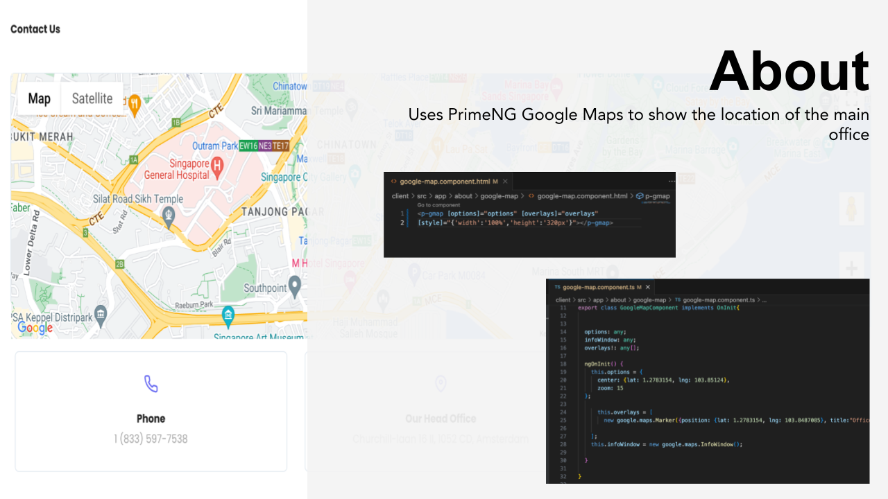
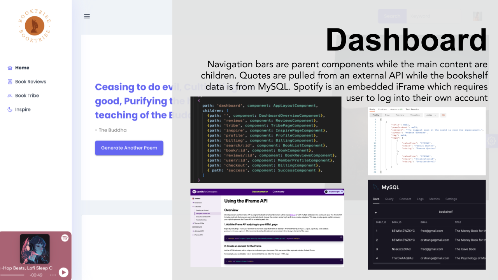
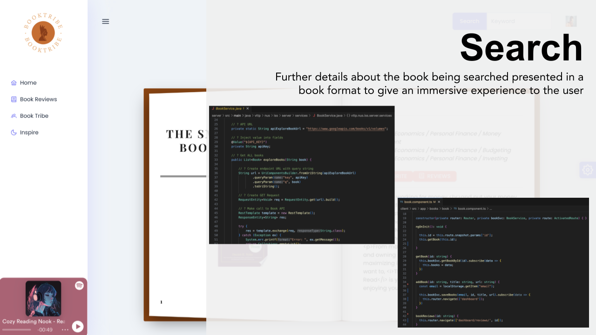
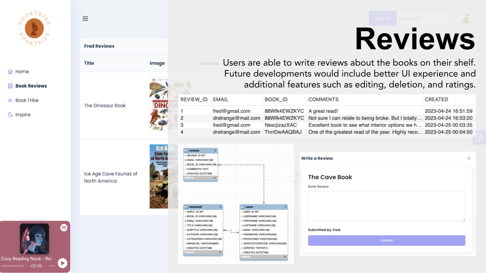
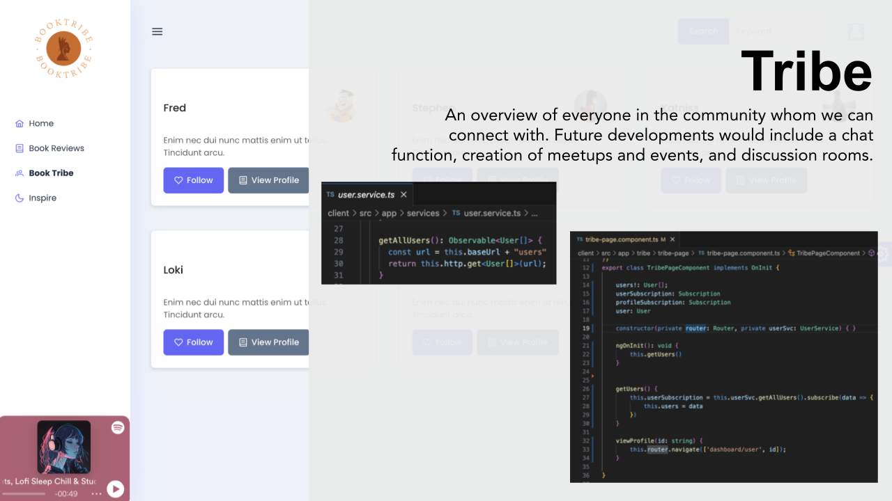
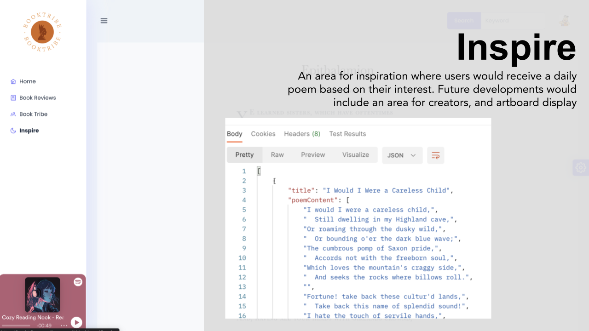
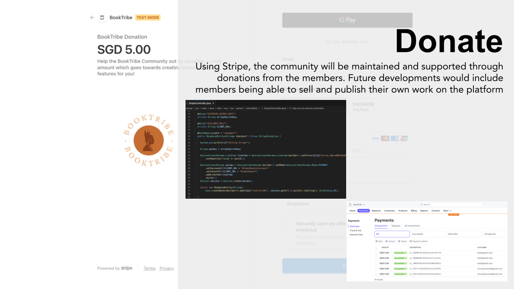

# VTTP 2022 Batch 2 Final Project

The application consists of a minimum of 2 logical parts: 


|    |   |
| ------------- | ------------- |
| Frontend - Angular  | Backend - SpringBoot  |
| **Focus:** What users visually see and interact with on their browser or application | **Focus:** Consists of the Server, Application and Database |
| Uses PrimeNG as the UI component framework  | Connects to MySQL & AmzonS3 Database  |
| Deployed on Railway  | Deployed on Railway  |


##  Angular

| Requirements  | Fulfilled? |
| ------------- | ------------- |
| Reactive Forms  | ✓ (All forms used are Reactive) |
| Use GET, POST, PUT, DELETE to communicate  | ✓ |
| SPA with 4 views  | ✓ |
| Abstract common functionalities into Services  | ✓ |
| Include application manifest  |   |

##  Spring Boot

| Requirements  | Fulfilled? |
| ------------- | ------------- |
| Use POST to handle either x-www-form-urlencoded and/or JSON and/or multipart payload | ✓ |
| Making HTTP request to external RESTful API |  ✓ |
| Parameterized Routes | ✓ |
| Query String | ✓  |
| Support more than 1 user | ✓  |

## Database
| Requirements  | Fulfilled? |
| ------------- | ------------- |
| Use MySQL | ✓ |
| Modeling data relationship: 1 to 1, 1 to Many (User Account, Bookshelf, Todo List) | ✓ |
| Demonstrate data integrity and consistency when updating multiple tables - Transactional | ✓ |
| Use another database - Amazon S3 Bucket (Profile Pictures) | ✓ |
| Use another database - MongoDB (Book Reviews) |  |


## Deployment
| Requirements  | Fulfilled? |
| ------------- | ------------- |
| Publicly accessible | ✓ |
| Deployed to Railway | ✓ |


## Additional Requirements
| Type | Requirements  | Fulfilled? |
| -------------| ------------- | ------------- |
SpringBoot Backend | Integrating with payment gateway - Stripe | ✓ |
SpringBoot Backend| Sending email - Uses SendGrid | ✓ |
Angular Frontend | Use map eg Google Map - PrimeNG GMap | ✓ |
Angular Frontend | Use UI component framework - PrimeNG | ✓ |
Deployment | Apply a domain name and configure your application to use the domain name| ✓ |

## How It Works

### Angular HttpClient

It performs the GET, POST, PUT, DELETE operations using the built-in service class. It uses the RxJS Observable-based APIs (similar to Promise and helps to manage async code), which means it returns the observable and what we need to subscribe it.

When we use HttpClient and returns the observables, below are the following points we need to consider:

- When we ```subscribe```, it will initiate the request, otherwise nothing happens.
- When the ```get()``` request returns successful, the observable emits the result and is then complete.
- When the ```get()``` request fails, the observable emits the error.

**HttpClient POST**

The HttpClient.post() method is similar to get() in that it has a type parameter, which you can use to specify that you expect the server to return data of a given type. The method takes a resource URL and two additional parameters:

```console
post(url: string, body: any, options: { headers?: [HttpHeaders]; 
context?: [HttpContext]; 
observe?: "body"; 
params?: [HttpParams]; 
reportProgress?: boolean; 
responseType: "text"; 
withCredentials?: boolean;  }):  Observable<string>
```

**Parameters**

- url: The back-end service url of type string.
- body: The content to send or replace with, of type any.
- options: The HTTP options of type object.

**Returns**

HTTP POST returns the observable response of type string.

### PrimeNG Components

**Dynamic Dialog**

Dialogs can be created dynamically with any component as the content using a [DialogService](https://www.primefaces.org/primeng-v13/dynamicdialog).

- Dynamic dialogs require an instance of a DialogService that is responsible for displaying a dialog with a component as its content. 
- Since the dynamically loaded content is not defined at build time, a configuration is necessary using the entryComponents of your parent module. 


### SendGrid 
SendGrid is a cloud-based SMTP provider that allows you to send email without having to maintain email servers. SendGrid manages all the technical details, from scaling the infrastructure to ISP outreach and reputation monitoring to whitelist services and real-time analytics. For more detailed information on how this was implemented, head over here: [Sending emails with SendGrid and spring boot](https://medium.com/javarevisited/sending-emails-with-sendgrid-and-spring-boot-81e9637a1f05)

**Dependency Required:**

```
<dependency>
<groupId>com.sendgrid</groupId>
<artifactId>sendgrid-java</artifactId>
<version>4.0.1</version>
</dependency>
```

### [Angular Google Map](https://angular-maps.com/) 


### Stripe Payment

**General Flow**

The charge of the credit card will be done in five simple steps, involving the front-end (run in a browser), back-end (our Spring Boot application), and Stripe:

1. A user goes to the checkout page and clicks “Pay with Card”.
2. A user is presented with Stripe Checkout overlay dialog, where fills the credit card details.
3. A user confirms with “Pay <amount>” which will:
4. Send the credit card to Stripe
5. Get a token in the response which will be appended to the existing form
6. Submit that form with the amount, public API key, email, and the token to our back-end
7. Our back-end contacts Stripe with the token, the amount, and the secret API key.
8. Back-end checks Stripe response and provide the user with feedback of the operation.


### Angular Route Guard

Based on user requirements, we can implement different guards. Angular provides the following different types of router guards:


1. **CanActivate**: Checks to see if we can visit a route based on condition.
2. **CanActivateChild**: Checks to see if we can visit route children based on condition.
3. **CanDeactivate**: Prevent the user from navigating away from the current content based on condition.
4. **canLoad**: Used to determine whether the user can navigate to a lazy-loaded module prior to loading it
5. Resolve Delay navigation until a task is complete before the route activation.


## Project Overview and Screenshots 















## Issues Encountered & Resolution

### Issue 1: CORS Error
**Issue Description:**
- After enabling Spring Security on the Backend side, there was a CORS error and the Angular Front-end was unable to POST or GET from the the Backend. 

**Resolved By:**
- Creating a proxy file 


### Issue 2: CORS Error with OAuth
- After adding the OAuth dependency and creating the SecurityFilterChain with CORS, Angular was unable to connect to the backend and CORS error was triggered.
- Suspect that there might be a conflict with my previous CORS file and this new SecurityFilterChain one

**Resolved By:**

